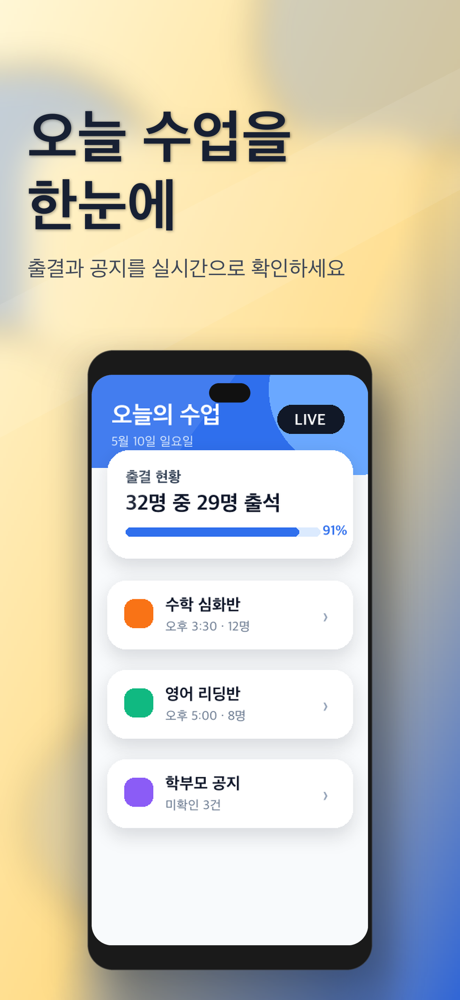
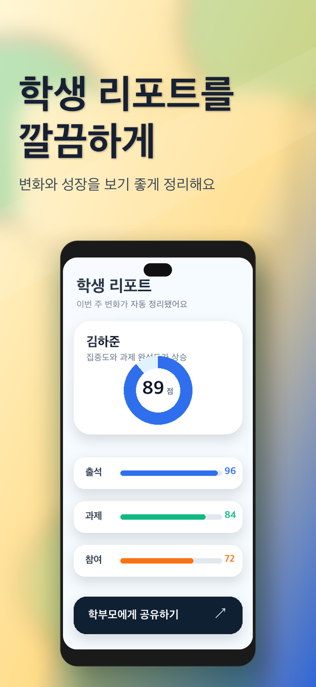
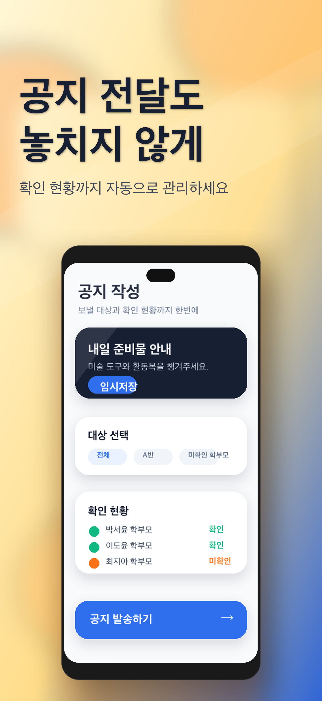

# appshot

앱스토어 배포에 필요한 스크린샷을 자동으로 생성하는 CLI 도구입니다.

원본 앱 스크린샷과 YAML 설정 파일만으로, Apple App Store · Google Play · Samsung Galaxy Store에서 요구하는 규격의 PNG 파일을 일괄 생성합니다.

---

## 출력 예시

<table>
  <tr>
    <td></td>
    <td></td>
    <td></td>
  </tr>
</table>

헤드라인을 상단에, 디바이스 목업을 하단에 배치하는 **ad 레이아웃** 기본 적용.  
실제 앱 스크린샷을 넣으면 위와 같이 생성됩니다.

---

## 주요 기능

- **modern ad 레이아웃** — 헤드라인 + 디바이스 + 블러 오브젝트 + 입체 그림자, 최신 앱스토어 광고 스타일
- **톤앤매너 자동화** — `tone: auto`로 앱 이름·문구·파일명에서 교육/금융/헬스/커머스 등 분위기 추론
- **프로젝트별 브랜딩** — `app_name`, `tone`, `accent_color`로 요청한 앱 성격에 맞는 색감과 무드 적용
- **디바이스 프레임 자동 합성** — iPhone Dynamic Island / Home Button, iPad, Android 프레임
- **배경 커스터마이징** — 단색 또는 그라데이션 (vertical / horizontal / diagonal)
- **볼드 한국어 폰트** — Apple SD Gothic Neo Bold 자동 탐색
- **전 플랫폼 지원** — Apple / Google / Samsung 8개 플랫폼 규격 내장
- **외부 에셋 불필요** — Pillow 하나로 모든 렌더링 처리

---

## 지원 플랫폼

| 플랫폼 | 사이즈 | 필수 |
|---|---|---|
| Apple iPhone | 6.9" 1320×2868, 6.5" 1242×2688, 5.5" 1242×2208 | ✅ |
| Apple iPad | 13" 2064×2752, 12.9" 2048×2732, 11" 1668×2388 | ✅ |
| Google Play Phone | 1080×1920 | ✅ |
| Google Play 7" Tablet | 1080×1920 | |
| Google Play 10" Tablet | 1280×1920 | |
| Google Play Feature Graphic | 1024×500 | |
| Samsung Galaxy Phone | 1080×2340 | |
| Samsung Galaxy Tab | 1600×2560 | |

---

## 설치

**Python 3.11 이상** 필요

```bash
git clone https://github.com/qpyu66/app-screenshot.git
cd app-screenshot

python3 -m venv .venv
source .venv/bin/activate      # Windows: .venv\Scripts\activate

pip install -e .
```

---

## 빠른 시작

### 1. 설정 파일 생성

```bash
appshot init
```

### 2. 스크린샷 준비

`./screens/` 폴더에 앱 스크린샷(PNG/JPG)을 넣습니다.

### 3. 설정 편집

```yaml
# screenshots.yaml

defaults:
  app_name: "클래스링"
  tone: auto                # auto | education | finance | health | commerce | social | productivity | game
  design_style: modern     # modern | classic
  accent_color: auto       # auto | "#hex"
  layout: ad               # ad (기본) | simple
  text_align: left
  frame_color: black       # auto | white | black | "#hex"
  fit_mode: cover
  output_dir: ./output

platforms:
  - apple_iphone
  - apple_ipad
  - google_phone
  - samsung_phone

screenshots:
  - input: ./screens/home.png
    headline: "오늘 수업,\n한눈에\n파악하세요"
    subtitle: "출결 현황부터 학생 등록 요청까지\n실시간으로 확인하세요"
    tone: education
    background:
      type: gradient
      direction: diagonal
      colors:
        - "#fff7d6"
        - "#ffdd8a"
        - "#3267d6"

  - input: ./screens/feature.png
    headline: "개인 맞춤\n리포트를 손쉽게"
    subtitle: "템플릿으로 반복 작업 없이\n클릭 몇 번으로 발송"
    background:
      type: solid
      color: "#c4a47c"

  - input: ./screens/notice.png
    headline: "공지사항,\n절대 놓치지\n않게"
    subtitle: "선생님의 공지를\n학생과 학부모가 실시간으로"
    background:
      type: gradient
      direction: vertical
      colors:
        - "#1a2744"
        - "#2d3f6e"
```

### 4. 빌드

```bash
appshot build
```

```
output/
  apple_iphone/
    01_home_iphone_69.png   (1320×2868)
    01_home_iphone_65.png   (1242×2688)
    01_home_iphone_55.png   (1242×2208)
    02_feature_iphone_69.png
    ...
  apple_ipad/
    01_home_ipad_13.png     (2064×2752)
  google_phone/
    01_home_phone.png       (1080×1920)
  samsung_phone/
    01_home_galaxy.png      (1080×2340)
```

---

## CLI 명령어

```bash
# 전체 빌드
appshot build

# 설정 파일 지정
appshot build -c path/to/screenshots.yaml

# 특정 플랫폼만
appshot build -p apple_iphone
appshot build -p google_phone

# 샘플 설정 파일 생성
appshot init

# 지원 플랫폼 및 사이즈 목록
appshot list-sizes
```

---

## 레이아웃

### `ad` (기본)

상단에 헤드라인, 하단에 디바이스 목업. 앱스토어 마케팅 스크린샷에 최적화.

```yaml
layout: ad
headline: "앱 이름,\n한눈에\n파악하세요"
subtitle: "핵심 기능을 한 문장으로 설명"
```

### `simple`

디바이스를 이미지 중앙에 배치하고 위/아래에 캡션 텍스트.

```yaml
layout: simple
caption: "핵심 기능 설명"
caption_position: bottom   # top | bottom
```

---

## 전체 설정 옵션

### `defaults`

| 키 | 기본값 | 설명 |
|---|---|---|
| `app_name` | `""` | 앱 이름. `tone: auto`일 때 톤 추론에 사용 |
| `tone` | `auto` | 디자인 톤. `auto`, `education`, `finance`, `health`, `commerce`, `social`, `productivity`, `game` |
| `design_style` | `modern` | `modern`은 최신 앱스토어풍 장식/그림자 적용, `classic`은 기존 단순 렌더링 |
| `accent_color` | `auto` | 프로젝트 브랜드 포인트 색상. `auto` 또는 `"#hex"` |
| `layout` | `ad` | 레이아웃 모드. `ad` 또는 `simple` |
| `frame_color` | `auto` | 디바이스 프레임 색상. `auto`는 배경 밝기에 따라 자동 선택 |
| `text_align` | `left` | 텍스트 정렬. `left` / `center` / `right` |
| `font_size` | `80` | simple 레이아웃 캡션 크기 (px) |
| `fit_mode` | `contain` | `contain`(레터박스) / `cover`(크롭) |
| `output_dir` | `./output` | 출력 폴더 |

### `screenshots` 항목별 옵션

| 키 | 설명 |
|---|---|
| `input` | 원본 스크린샷 경로 (필수) |
| `tone` | 이 슬라이드만 디자인 톤 지정 |
| `accent_color` | 이 슬라이드만 포인트 색상 지정 |
| `headline` | 큰 볼드 헤드라인 (`\n`으로 줄바꿈) |
| `subtitle` | 헤드라인 아래 작은 텍스트 |
| `layout` | 이 슬라이드만 레이아웃 지정 |
| `text_align` | `left` / `center` / `right` |
| `caption` | simple 레이아웃 캡션 |
| `caption_position` | `top` / `bottom` |
| `caption_color` | `auto` 또는 `"#hex"` |
| `fit_mode` | `contain` / `cover` |
| `background.type` | `solid` 또는 `gradient` |
| `background.color` | 단색 배경 hex |
| `background.colors` | 그라데이션 색상 배열 |
| `background.direction` | `vertical` / `horizontal` / `diagonal` |

---

## 의존성

```
Pillow >= 10.0.0
click  >= 8.1.0
PyYAML >= 6.0
```

---

## 라이선스

MIT
